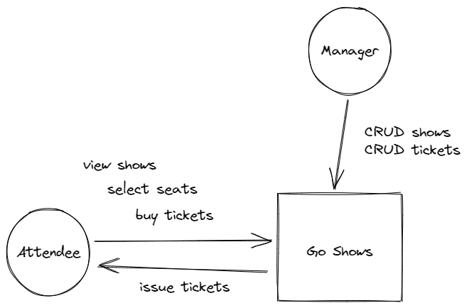

# go-shows

Go Shows is a proof-of-concept web application for an entertainment website that sells shows. It is an effort to learn React and Go.

## Technologies Used

- Front-end
  - TypeScript
  - React
  - React Router
  - Tailwind
  - Headless UI
- Back-end
  - Go
  - Gorilla Mux
  - Godotenv
  - Gorm
